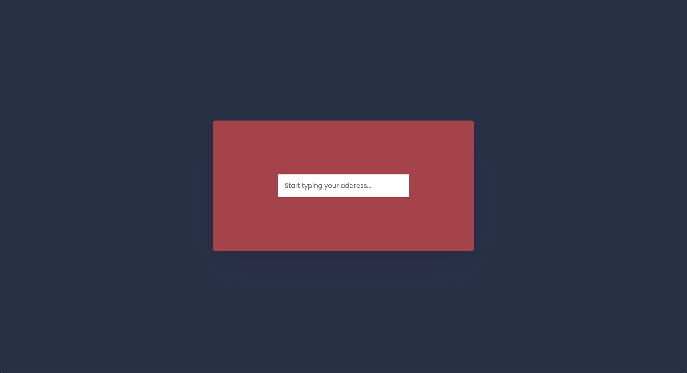

# fndmprsh

Try out the find my parish [HERE](https://vildmedpap.github.io/fndmprsh/).

## Description

Type in your address and know which parish you belong to.
For Danes only! 🇩🇰 (using a Danish autocomplete API)

## Learning objectives

Purely frontend objectives:

-   **HTML**: _datalist_
-   **CSS**: _positioning with flex box_, _styling input_, _animation_
-   **JavaScript**: _axios_, _event listener on input, keydown, load_, _autocompletion_, _async await_

## Notes

There it not much styling available for the `option` tag. I should rewrite my code to use something else than `datalist`.
